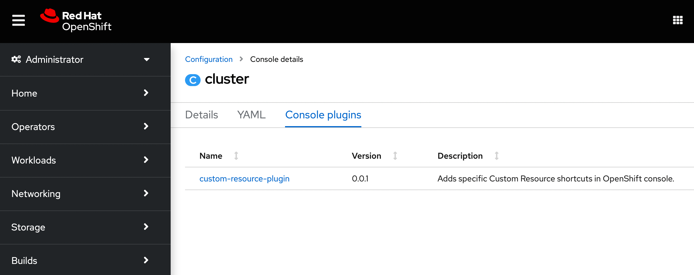

# Custom Resource plugin for OpenShift Console

This project contains an example of a minimal OpenShift Console dynamic plugin.
The plugin will customize the console with menu items for specific custom
resources defined. `SealedSecrets` is used as an example.

It requires OpenShift 4.11. For an example of a plugin that works with
OpenShift 4.10, see the `release-4.10` branch of [this repository](https://github.com/openshift/console-plugin-template/tree/release-4.10).

[Dynamic plugins](https://github.com/openshift/console/tree/master/frontend/packages/console-dynamic-plugin-sdk)
allow you to extend the
[OpenShift UI](https://github.com/openshift/console)
at runtime, adding custom pages and other extensions. They are based on
[webpack module federation](https://webpack.js.org/concepts/module-federation/).
Plugins are registered with console using the `ConsolePlugin` custom resource
and enabled in the console operator config by a cluster administrator.


## How a minimal plugin is created

This repo was created by forking the [openshift/console-plugin-template](https://github.com/openshift/console-plugin-template) repo.

With a template in place, three parts were modified:

- [package.json](package.json): plugin metadata
- [console-extensions.json](console-extensions.json): extensions used by the plugin (navigation etc)
- [src/components/\*.{tsx,css}](src/components): the React component for custom UI's


#### package.json

Plugin metadata like name and version in the `consolePlugin` section.

```json
"consolePlugin": {
  "name": "custom-resource-plugin",
  "version": "0.0.1",
  "displayName": "Custom Resource Plugin",
  "description": "Adds specific Custom Resource shortcuts in the OpenShift console.",
  "exposedModules": {
    "CustomResources": "./components/CustomResources"
  },
  "dependencies": {
    "@console/pluginAPI": "*"
  }
}
```

#### console-extensions.json

In `console-extensions.json` you can add extensions that allow you to customize your plugin. Those extensions are then loaded to the console at run-time.

This minimal plugin uses the `console.navigation/resource-ns` extension to add a specific namespaced resource as a navigation item.

The OpenShift documentation has a good reference of the [extension types](https://docs.openshift.com/container-platform/4.11/web_console/dynamic-plug-ins.html#dynamic-plug-in-sdk-extensions_dynamic-plugins) currently available.

```json
[
  {
    "type": "console.page/route",
    "properties": {
      "exact": true,
      "path": "/customresources",
      "component": { "$codeRef": "CustomResources" }
    }
  },
  {
    "type": "console.navigation/resource-ns",
    "properties": {
      "perspective": "admin",
      "section": "workloads",
      "id": "sealedsecrets",
      "insertAfter": "secrets",
      "name": "SealedSecrets",
      "model": {
        "group": "bitnami.com",
        "version": "v1alpha1",
        "kind": "SealedSecret"
      }
    }
  }
]
```

#### React component

The third part is the React component(s) for creating custom UI content.

See [src/components/](src/components) for an example from the template.


## Build container image

Before you can deploy your plugin on a cluster, you must build an image and
push it to an image registry. This repository contains a sample [Containerfile](Dockerfile.ubi)
based on Red Hat UBI.

1. Build the image:

   ```sh
   podman build -f Dockerfile.ubi -t quay.io/my-repositroy/custom-resource-plugin:latest .
   ```

2. Push the image:

   ```sh
   podman push quay.io/my-repository/custom-resource-plugin:latest
   ```

## Deployment on cluster

A [Helm](https://helm.sh) chart is available to deploy the plugin to an OpenShift environment.

The following Helm parameters are required:

`plugin.image`: The location of the image containing the plugin that was previously pushed

Additional parameters can be specified if desired. Consult the chart [values](charts/openshift-console-plugin/values.yaml) file for the full set of supported parameters.

### Installing the Helm Chart

Install the chart using the name of the plugin as the Helm release name into a new namespace or an existing namespace as specified by the `my-plugin-namespace` parameter and providing the location of the image within the `plugin.image` parameter by using the following command:

```sh
helm upgrade -i custom-resource-plugin charts/openshift-console-plugin -n my-plugin-namespace --create-namespace --set plugin.image=quay.io/my-repository/custom-resource-plugin:latest
```

Plugin deployed in OpenShift:


## References

- [Console Plugin SDK README](https://github.com/openshift/console/tree/master/frontend/packages/console-dynamic-plugin-sdk)
- [Customization Plugin Example](https://github.com/spadgett/console-customization-plugin)
- [Dynamic Plugin Enhancement Proposal](https://github.com/openshift/enhancements/blob/master/enhancements/console/dynamic-plugins.md)
